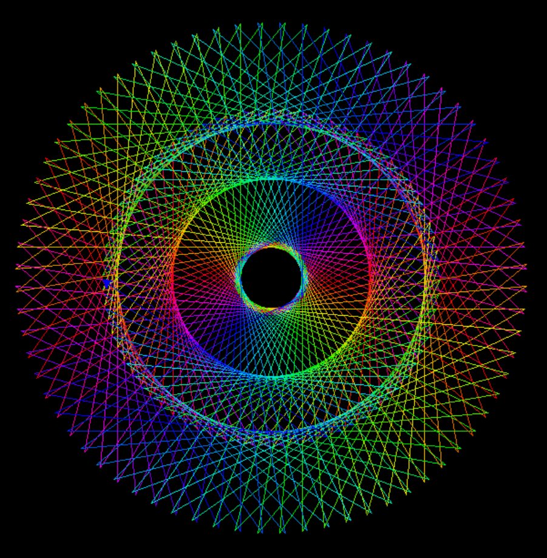
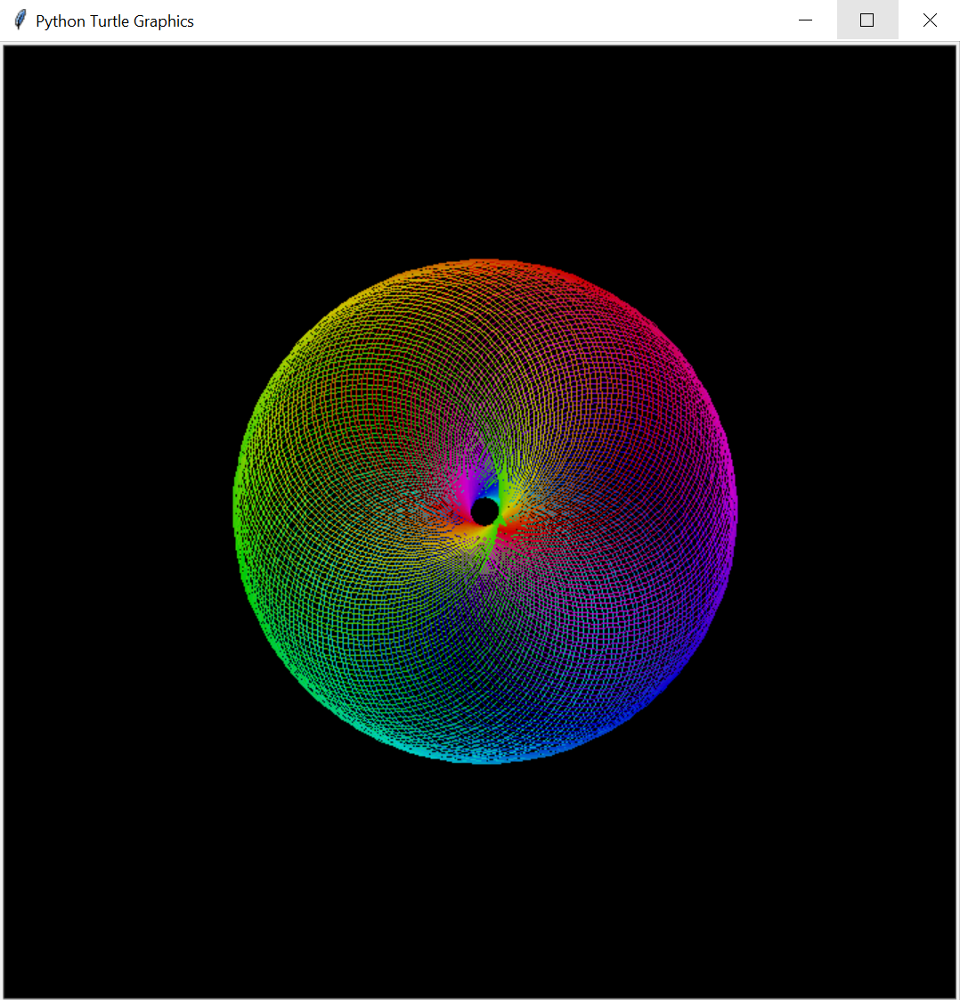
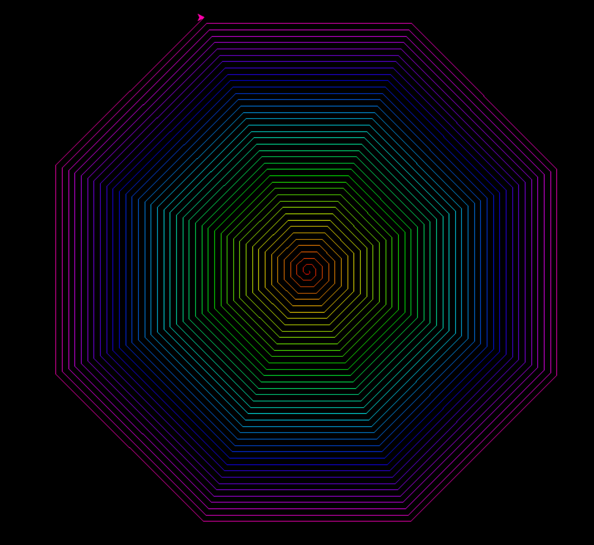

# Turtle Graphics - Code 1 🌀🌈

🍁This Python script uses the Turtle graphics library to create a mesmerizing pattern.🍄 The turtle moves in a circular motion, drawing colorful lines as it rotates.🕸 The colors are generated using the HSV color space.🌟🎄

## Note
 - 🌵 This is my first python code.🎍

## Features

- Circular pattern drawing using Turtle graphics.
- Dynamic color generation using the HSV color space.

## Usage

1. Make sure you have Python installed.
2. Copy the code into a Python file (e.g., `turtle_pattern_1.py`).
3. Run the script.

## Customization

- Adjust the `n` variable for a different number of iterations and patterns.
- Experiment with the `colorsys.hsv_to_rgb` parameters for varied color schemes.
- Modify the `t.left(145)` angle for different rotations.

## Example 🎨

Here's a sample output:

# Turtle Graphics - Code 2 🌀🌈

This Python script uses the Turtle graphics library to draw a colorful spiral. The turtle rotates and moves forward, creating a visually appealing pattern. Colors are generated using the HSV color space.

## Features

- Spiraling pattern drawing using Turtle graphics.
- Dynamic color generation using the HSV color space.

## Usage

1. Ensure you have Python installed.
2. Copy the code into a Python file (e.g., `turtle_spiral.py`).
3. Run the script.

## Customization

- Adjust the `n` variable for a different number of iterations and patterns.
- Experiment with the `colorsys.hsv_to_rgb` parameters for varied color schemes.
- Modify the `t.left(2)` angle and `t.circle(100)` radius for different spiral shapes.

## Example 🎨

Here's a sample output:

# Turtle Graphics - Code 3 🌀🌈

This Python script uses the Turtle graphics library to draw a vibrant and intricate spiral pattern. The turtle moves in a circular motion, creating a visually appealing design with changing colors.

## Features

- Intricate spiral pattern drawing using Turtle graphics.
- Dynamic color generation using the HSV color space.

## Usage

1. Make sure you have Python installed.
2. Copy the code into a Python file (e.g., `turtle_spiral_pattern.py`).
3. Run the script.

## Customization

- Adjust the `n` variable for a different number of iterations and patterns.
- Experiment with the `colorsys.hsv_to_rgb` parameters for varied color schemes.
- Modify the `t.left(1)` angle and `t.fd(1)` distance for different spiral shapes.

## Example 🎨

Here's a sample output:

Explore the code and make your own modifications to generate unique spiral patterns!

